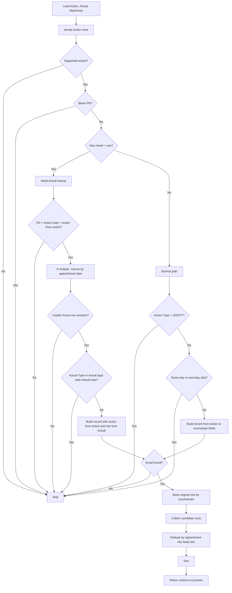

# Daily Patient Reminder Business Logic

This document reflects the current code path in `excel_reader.get_actions_to_process()` and `simulate_daily.py`.

## Logic Tree

```text
START
|
+-- Load 3 inputs
|   +-- Action report (drop trailing total/summary row when present)
|   +-- Actual report
|   +-- Mailchimp export
|
+-- Read Action rows one by one
    |
    +-- Is Action supported?
    |   +-- No -> SKIP
    |   +-- Yes -> continue
    |       Supported:
    |       - CREATE -> create
    |       - RESCHEDULE -> reschedule
    |       - DELETE -> delete
    |       - CANCEL... -> cancel
    |
    +-- Is PN blank and SKIP_BLANK_PN enabled?
    |   +-- Yes -> SKIP
    |   +-- No -> continue
    |
    +-- Is Has Newer = yes?
    |   +-- No -> normal path
    |   |   +-- Is Type = UNCPT on Action row?
    |   |   |   +-- Yes -> SKIP
    |   |   |   +-- No -> continue
    |   |   +-- Is Action appointment date same-day?
    |   |   |   +-- Yes and SKIP_SAME_DAY=True -> SKIP
    |   |   |   +-- No -> continue
    |   |   +-- Is Action appointment date next-day?
    |   |       +-- Yes and SKIP_NEXT_DAY=True -> SKIP
    |   |       +-- No -> build record from Action row
    |   +-- Yes -> resolve Actual row first
    |
    +-- On has_newer path: run Actual matching tree
    |
    +-- Build output record
    |   +-- If build fails -> SKIP
    |   +-- Else continue
    |
    +-- Is resolved Type = UNCPT?
    |   +-- Yes -> SKIP
    |   +-- No -> continue
    |
    +-- Is email missing after Mailchimp lookup/default override?
    |   +-- Yes and no DEFAULT_RECIPIENT_EMAIL -> SKIP
    |   +-- No -> continue
    |
    +-- If action = reschedule
    |   +-- store original_appt_date/original_appt_time from Action row
    |
    +-- Add to candidate output list
        |
        +-- After all rows: group actions by appointment key
        |   +-- reschedule key = PN + original Action date + original Action time
        |   +-- others key = PN + final appt_date + final appt_time
        |   +-- sort within group by PN + Appt Date + Appt Time + Action Time
        |   +-- if group is exactly create/delete or delete/create -> SKIP whole group
        |   +-- otherwise keep last item in sorted group
        |
        +-- Sort results
        |
        +-- Return [{action, record}, ...]
```

## Actual Matching Tree

This branch runs only when `Has newer = yes`.

```text
Find Actual row for current Action row
|
+-- Filter Actual rows by same PN
|   +-- none -> SKIP
|
+-- Narrow to rows where:
|   +-- Actual Action Date == Action Action Date
|   +-- Actual Action Time == Action Action Time
|   +-- none -> SKIP
|   +-- one -> USE IT
|   +-- many -> continue
|
+-- Narrow remaining rows by:
|   +-- Actual appointment Date == Action appointment Date
|   +-- none -> SKIP
|   +-- one -> USE IT
|   +-- many -> continue
|
+-- Narrow remaining rows by:
|   +-- Actual appointment Time == Action appointment Time
|   +-- none -> SKIP
|   +-- one -> USE IT
|   +-- many -> SKIP as ambiguous
|
+-- Apply Actual-based skip checks
|   +-- Actual Type = UNCPT -> SKIP
|   +-- Actual appt date is same-day and SKIP_SAME_DAY=True -> SKIP
|   +-- Actual appt date is next-day and SKIP_NEXT_DAY=True -> SKIP
|
+-- Build final record
    +-- action -> from Action report
    +-- appt_date -> from Actual row
    +-- appt_time -> from Actual row
    +-- location -> from Actual row
    +-- appt_type -> from Actual row
```

## Field Mapping

### 1. Normal create / cancel / delete path

```text
Output record
|
+-- pn -> Action.PN
+-- email -> DEFAULT_RECIPIENT_EMAIL if set, otherwise Mailchimp[PN].Email
+-- mailchimp_email -> Mailchimp[PN].Email, if found
+-- patient_name -> Mailchimp Name OR Action Patient Name
+-- appt_date -> Action.Date
+-- appt_time -> Action.Time
+-- location -> Action.Location
+-- location_address -> LOCATION_MAP[location]
+-- appt_type -> Action.Type
```

### 2. Reschedule without Actual lookup

```text
Output record
|
+-- pn -> Action.PN
+-- email -> DEFAULT_RECIPIENT_EMAIL if set, otherwise Mailchimp[PN].Email
+-- mailchimp_email -> Mailchimp[PN].Email, if found
+-- patient_name -> Mailchimp Name OR Action Patient Name
+-- original_appt_date -> Action.Date
+-- original_appt_time -> Action.Time
+-- appt_date -> Reschedule Into parsed date
|               OR Reschedule Date
|               OR Action.Date
+-- appt_time -> Reschedule Into parsed time
|               OR Reschedule Time
|               OR Action.Time
+-- location -> Action.Location
+-- location_address -> LOCATION_MAP[location]
+-- appt_type -> Action.Type
```

### 3. Has newer path

```text
Output record
|
+-- pn -> Action.PN
+-- email -> DEFAULT_RECIPIENT_EMAIL if set, otherwise Mailchimp[PN].Email
+-- mailchimp_email -> Mailchimp[PN].Email, if found
+-- patient_name -> Mailchimp Name OR Action Patient Name
+-- action -> Action.Action
+-- appt_date -> matched Actual appointment Date
+-- appt_time -> matched Actual appointment Time
+-- location -> matched Actual.Location
+-- location_address -> LOCATION_MAP[location]
+-- appt_type -> matched Actual.Type
```

Important detail:

- On this path, the action comes from the Action report, but the appointment slot comes from the Actual report.
- On this path, Actual is also the source for skip checks tied to appointment date and type.

## Skip Rules Summary

```text
SKIP when:
- action is blank or unsupported
- PN is blank and SKIP_BLANK_PN=True
- on non-has_newer path: Action.Type = UNCPT
- on non-has_newer path: same-day appointment and SKIP_SAME_DAY=True
- on non-has_newer path: next-day appointment and SKIP_NEXT_DAY=True
- has_newer path cannot find a usable Actual match
- record build fails
- resolved appt_type = UNCPT
- has_newer path resolved appointment date is same-day / next-day per flags
- email is missing after Mailchimp lookup and DEFAULT_RECIPIENT_EMAIL is blank
- exception: allow a `reschedule` when the original Action appointment date is beyond next day and the resolved appointment is moved into next day
- exception: if the same appointment has exactly one `create` and one `delete` action in the same run, skip both instead of sending either
```

## Has Newer Skip Rule

```text
On the Actual path, skip only when:
- no Actual match is found
- Actual Type = UNCPT
- Actual appointment date is today or next day, depending on skip flags
```

## Mapping Rules Summary

```text
Normalize action:
- CREATE -> create
- RESCHEDULE -> reschedule
- DELETE -> delete
- CANCEL w. remove / any "cancel..." value -> cancel

Normalize time:
- 04:30p -> 16:30:00
- 11:30a -> 11:30:00
- blanks/unparseable values default through time normalizer rules

Map location:
- LIB  -> 115 Columbus Dr, Ste 300, Jersey City, NJ 07302
- LIBN -> 132 Newark Ave, Jersey City, NJ 07302
- LIBJ -> 2 Journal Sq Plaza, Jersey City, NJ 07306
```

## Mermaid Version


