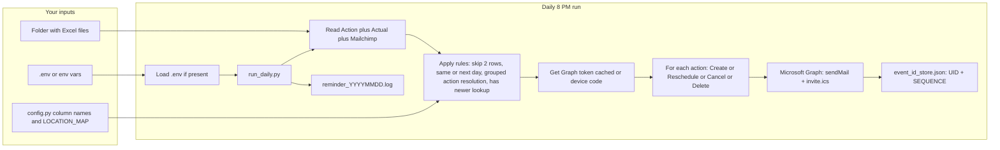

# Daily Patient Reminder (Liberty PT & Wellness)

Automation that runs **daily at 8 PM** on your computer: reads appointment data from Excel, looks up patient emails from a Mailchimp export, and sends **one** confirmation email per action via Microsoft Graph **Mail.Send**: HTML body plus an attached **`invite.ics`** (or **`cancel.ics`**) for the patient to add to their calendar. Same flow for every provider—no Gmail‑specific code paths.

---

## Main Scripts

- **`simulate_daily.py`**: dry-run the daily logic and review what would happen.
- **`one_time_send.py`**: send the one-time launch file in the simple `Date / Time / Patient # / Patient Fir / Patient La / Location / App Type / Email` format.
- **`run_daily.py`**: run the ongoing daily production flow from Action + Actual + Mailchimp, and automatically generate a simulation workbook first.

Those are the only three scripts you need for the planned workflow.

---

## Dry Run Vs Actual Send

### Daily validation

Dry run:

```bash
python3 simulate_daily.py
```

This does **not** send emails. It writes a simulation workbook so you can review what would happen.

Actual send:

```bash
python3 run_daily.py
```

This uses the Action + Actual + Mailchimp inputs, writes a fresh simulation workbook, and then sends the configured patient emails.

Current safety default: `DEFAULT_RECIPIENT_EMAIL` is set to `ddmittalp@gmail.com`, so `run_daily.py` sends every patient invite/cancel only to that address. Set `DEFAULT_RECIPIENT_EMAIL=` in `.env` when you are ready to send to the actual Mailchimp recipients.

## Folder Layout

All working paths are now derived from the project root automatically.

```text
daily-patient-reminder/
├── Excel/
│   ├── action.xlsx
│   ├── actual.xlsx
│   └── processed_mailchimp_export.xlsx
├── logs/
├── simulations/
├── config.py
├── run_daily.py
└── simulate_daily.py
```

If you move the repo to another device, the scripts use that new project folder as the root automatically.  
Optional override: set `REMINDER_ROOT_FOLDER` if you want to point the app at a different root.

### One-time launch file

Dry run:

```bash
python3 one_time_send.py --report-path "/path/to/launch_file.xlsx"
```

This does **not** send emails. It writes a one-time log workbook for review.

Actual send:

```bash
python3 one_time_send.py --report-path "/path/to/launch_file.xlsx" --send
```

This sends real patient emails and stores invite IDs in `event_id_store.json` for future reschedules/cancels.

---

## What the tool does (end-to-end)

1. **Reads three data sources** (from your configured folder):
   - **Action report** (Scheduler Activity Report style) – **Action** (`CREATE`, `RESCHEDULE`, `CANCEL w. remove`, `DELETE`, …), **PN**, **Date** / **Time** (`M/D/YYYY`, `04:30p`), **Type**, **Location**, **Reschedule Into** or **Reschedule Info** (same meaning), **Has newer** or **Has newer Date** (same meaning). Visits are keyed by **PN + Date + Time** (no separate ID column required).
   - **Actual report** – current appointment state; used when **Has newer** is Yes so reschedule/cancel can use the latest slot (or skip if missing / today per rules). It does **not** need every column the Action sheet has (see below).
   - **Mailchimp export** – **PN**, **Email**, **First** / **Last** (or **Name**) for display name and sending.

2. **Applies rules**:
   - Skips first 2 rows of the action sheet.
   - Skips same-day (and optionally next-day) appointments.
   - Skips rows with blank PN.
   - If multiple actions exist for the same appointment, groups them by appointment slot, sorts by **PN + appointment date + appointment time + Action Time**, and keeps the final action.
   - If the same appointment has exactly one **Create** and one **Delete** in the same run, skips both.
   - **Has newer** rows are resolved against the **Actual** sheet using **PN + Action Date + Action Time**, then narrowed by appointment date/time when needed.
   - Reschedules moved from a future date into **next day** still send an updated invite even when `SKIP_NEXT_DAY=True`.
   - Removes the trailing Action export total/summary row before processing.

3. **Location codes** → full address in the email:
   - **Location** column holds codes (LIB, LIBN, LIBJ). The tool maps them to full addresses in the confirmation and calendar invite (see `config.LOCATION_MAP`).

4. **Sends via Microsoft Graph** (`sendMail`) — **one email** per action:
   - **Create**: HTML + **`invite.ics`**; **stores ICS UID + SEQUENCE** in `event_id_store.json`.
   - **Reschedule**: same UID, higher SEQUENCE, updated **`invite.ics`** (clients that honor SEQUENCE merge the event).
   - **Cancel** / **Delete**: short HTML + **`cancel.ics`**; then remove the stored UID.

5. **Logging**: Writes a daily log file, optional **Excel audit** (`invite_sent_log.xlsx` / `INVITE_LOG_PATH`: one row per email sent), and (optionally) logs every invite/change to the daily log file.

6. **End-of-run cleanup/reporting**: On a clean `run_daily.py` run, renames processed inputs to `Excel/action_YYYY-MM-DD.xlsx` and `Excel/actual_YYYY-MM-DD.xlsx`, then sends a success/failure report to `DAILY_REPORT_EMAIL`.

---

## What you need to provide (checklist)

| # | What | Where / how |
|---|------|-------------|
| 1 | **Folder** where Excel and Mailchimp files live | `REMINDER_BASE_FOLDER` (env or .env) or edit `BASE_FOLDER` in `config.py`. |
| 2 | **Action report** (and optionally **Actual** in same or another file) | Put file(s) in that folder; set `ACTION_REPORT_PATH`, `ACTION_SHEET_NAME`, `ACTUAL_*` if different from defaults. |
| 3 | **Mailchimp export** (PN → Email) | Put file in folder; set `MAILCHIMP_EXPORT_PATH` if needed. |
| 4 | **Column names** matching your Excel | Edit `COL_*` in `config.py` (Action, PN, Appt Date, Appt Time, Location, Reschedule Date/Time, Has Newer Action, and Mailchimp PN/Email/Name). |
| 5 | **Location codes** | Already set in `config.py` (LIB, LIBN, LIBJ). Change `LOCATION_MAP` if your codes differ. |
| 6 | **Azure app** (Graph) | Register app; for **app-only**: Application permissions + admin consent; for **delegated**: Delegated permissions + redirect URI. |
| 7 | **GRAPH_CLIENT_ID** | Required. In `.env` (recommended). |
| 8 | **App-only (no sign-in)** | `GRAPH_CLIENT_SECRET`, `GRAPH_TENANT_ID`, **`GRAPH_MAILBOX_USER`** (organizer email). Azure: Application permissions + admin consent. |
| 9 | **Delegated (sign-in)** | Leave `GRAPH_CLIENT_SECRET` empty; optional `GRAPH_TENANT_ID`. First run: device code or browser; token may cache. |
| 10 | **`GRAPH_MAILBOX_USER`** | Mailbox that sends mail (`/users/{email}/sendMail`); **required** with app-only. Optional with delegated if you rely on `/me` (see `graph_user.py`). |
| 11 | **Test recipient override** | `DEFAULT_RECIPIENT_EMAIL` defaults to `ddmittalp@gmail.com`; set it empty to use Mailchimp emails. |
| 12 | **Completion report** | `DAILY_REPORT_EMAIL` defaults to `deepak@libertyptnj.com`. |

No other env vars are required unless you override paths (then the corresponding `*_PATH` / `*_FOLDER` vars).

---

## Env and .env

You don’t have to use environment variables: defaults in `config.py` work if your files and column names match. For the **8 PM run** (cron or Task Scheduler), the environment is often empty, so the recommended approach is:

1. **Copy `.env.example` to `.env`** in the project folder.
2. **Fill in** only the Graph / Outlook values you need such as `GRAPH_CLIENT_ID`, `GRAPH_CLIENT_SECRET`, `GRAPH_TENANT_ID`, and `GRAPH_MAILBOX_USER`.
3. **Do not commit `.env`** (it’s in `.gitignore`). Commit only `.env.example`.

You no longer need `.env` for file paths. Input files are expected under `Excel/`, logs go under `logs/`, and simulation workbooks go under `simulations/`.

---

## How it works



- **First time:** Provide folder, files, column names, and `GRAPH_CLIENT_ID` (e.g. in .env). Run `run_daily.py` once; sign in when prompted; the token is cached.
- **Every day at 8 PM:** The scheduler runs `run_daily.py`. It loads config (from .env / env / config.py), reads the three data sources, applies the rules, uses the cached token (or prompts again if expired), and for each row sends the appropriate email with **invite.ics** or **cancel.ics**; everything is logged to `reminder_YYYYMMDD.log`.

---

## Details you need to provide

### 1. File paths and sheet names

In **`config.py`** (or via environment variables):

| What | Config / env | Example |
|------|------------------|--------|
| Folder where files are placed | `BASE_FOLDER` / `REMINDER_BASE_FOLDER` | `~/Desktop/Git_projects/daily-patient-reminder` |
| Action report path | `ACTION_REPORT_PATH` | `action report.xlsx` |
| Action sheet name or index | `ACTION_SHEET_NAME` | `"Action"` or e.g. `"3-16 action appt"` |
| Actual report path | `ACTUAL_REPORT_PATH` | `actual report.xlsx` |
| Actual sheet name or index | `ACTUAL_SHEET_NAME` | `"Actual"` or e.g. `"3-16 actual appt"` |
| Mailchimp export path | `MAILCHIMP_EXPORT_PATH` | `processed_mailchimp_export.xlsx` |
| Mailchimp sheet | `MAILCHIMP_SHEET_NAME` | `0` (first sheet) |
| Test recipient override | `DEFAULT_RECIPIENT_EMAIL` | `ddmittalp@gmail.com`; empty means use Mailchimp recipients |
| Completion report recipient | `DAILY_REPORT_EMAIL` | `deepak@libertyptnj.com` |

### 2. Excel column names

Defaults match the **Scheduler Activity Report** style (Date/Time as `M/D/YYYY` and `04:30p`, Action values like `CREATE`, `CANCEL w. remove`). Adjust in **`config.py`** if your export differs.

**Action / Actual sheets:**

| Purpose | Config constant | Default |
|--------|------------------|--------|
| Action | `COL_ACTION` | `"Action"` — `CREATE`, `RESCHEDULE`, `DELETE`, `CANCEL w. remove` (mapped to cancel) |
| Patient number | `COL_PN` | `"PN"` — must match Mailchimp `PN` (numeric OK) |
| Appointment date | `COL_APPT_DATE` | `"Date"` |
| Appointment time | `COL_APPT_TIME` | `"Time"` — supports `04:30p` / `11:30a` |
| Location | `COL_LOCATION` | `"Location"` |
| Type (duration) | `COL_APPT_TYPE` | `"Type"` — e.g. `30DN`, `MT50` (see `APPOINTMENT_TYPE_DURATION_MINUTES`) |
| Reschedule (production) | `COL_RESCHEDULE_INTO` | `"Reschedule Into"` — single text, e.g. `Time: 12:00p -> 10:00a` or `Date: ... -> ... Time: ... -> ...` |
| Reschedule (alias) | `COL_RESCHEDULE_INTO_ALIASES` | Env: comma-separated extra names, default includes **`Reschedule Info`** if your export uses that header instead |
| Legacy reschedule | `COL_RESCHEDULE_DATE` / `COL_RESCHEDULE_TIME` | Used only if `Reschedule Into` is empty |
| Has newer | `COL_HAS_NEWER_ACTION` | `"Has newer"` — also matches **`Has newer Date`**, `"Has Newer Action"`, `"Has newer actions?"` (case-insensitive) |

If the **Actual** tab uses different headers (e.g. `Last Schedul` for date), set env vars `ACTUAL_COL_DATE`, `ACTUAL_COL_TIME`, etc. (see `config.py`).

#### How visits are keyed (ICS + grouped resolution)

The app does **not** require an **Appointment ID** column. Each visit is identified by **PN + scheduled Date + Time** from the exports (for **reschedule**, the **original** date/time on the Action row is used so the same calendar invite is updated). That key is stored in `event_id_store.json` and is also used to group repeated actions for the same visit so the tool can resolve same-appointment conflicts before sending.

#### Why Actual doesn’t need “all” Action columns

Action and Actual are **different reports**. Action carries **what changed** (create/reschedule/cancel, reschedule text, staff, “has newer”). Actual is only read for **current** PN / date / time / location / type when **Has newer** rules apply. Columns like **Reason**, **Comment**, or **User Name** are often **empty** or absent on Actual — that’s expected. Your screenshot’s **CHECK IN** / **CHECK OUT** rows are normal activity history; this job only sends mail for **CREATE / RESCHEDULE / CANCEL / DELETE** on the **Action** file’s Action column, not for check-in/out.

**Mailchimp / audience export:**

| Purpose | Config constant | Default |
|--------|------------------|--------|
| Patient number | `COL_MAILCHIMP_PN` | `"PN"` |
| Email | `COL_MAILCHIMP_EMAIL` | `"Email"` |
| Name | `COL_MAILCHIMP_FIRST` / `COL_MAILCHIMP_LAST` | `"First"`, `"Last"` — combined for calendar display |
| Single name column (optional) | `COL_MAILCHIMP_NAME` | `"Name"` — used if present instead of First+Last |

### 3. Location codes

In **`config.py`**, **`LOCATION_MAP`** already has:

- **LIB** → 115 Columbus Dr, Ste 300, Jersey City, NJ 07302  
- **LIBN** → 132 Newark Ave, Jersey City, NJ 07302  
- **LIBJ** → 2 Journal Sq Plaza, Jersey City, NJ 07306  

Add or change codes here if your Excel uses different ones.

### 4. Microsoft Graph (Outlook mail)

Mail uses **`POST /users/{GRAPH_MAILBOX_USER}/sendMail`** when **`GRAPH_MAILBOX_USER`** is set (e.g. `deepak@libertyptnj.com`). If it is empty **and** you use delegated auth, the app uses **`/me/sendMail`** and reads your address from **`GET /me`** (needs **User.Read**).

**A) App-only (recommended for cron — no sign-in)**  
- In Azure → App registration → **Certificates & secrets**: create a **client secret**.  
- **API permissions** → **Application permissions**: **Mail.Send** → **Grant admin consent**. (**Calendars.\*** is *not* required — invites are `.ics` attachments.)  
- In **`.env`**: `GRAPH_CLIENT_ID`, `GRAPH_CLIENT_SECRET`, `GRAPH_TENANT_ID`, **`GRAPH_MAILBOX_USER`** (the mailbox that sends the messages and appears as **ORGANIZER** in the `.ics` file).  
- Do **not** commit secrets to `config.py`; use `.env` only.

**B) Delegated (device code / browser)**  
- Leave **`GRAPH_CLIENT_SECRET`** empty.  
- **Delegated** permissions: **Mail.Send**, **User.Read** (for `/me` when `GRAPH_MAILBOX_USER` is unset); add a **Mobile and desktop** redirect URI if needed.  
- Set **`GRAPH_CLIENT_ID`**; optional **`GRAPH_TENANT_ID`**.  
- Optional **`GRAPH_MAILBOX_USER`**: if set, URLs use `/users/{email}/...` (must match the account you sign in as). If unset, uses `/me/sendMail`.  
- First run prompts for sign-in; token may be cached.

---

## Dependencies

- **Python**: 3.10 or newer.
- **Libraries** (install with `pip install -r requirements.txt`):
  - `requests` – HTTP for Microsoft Graph.
  - `msal` – Microsoft auth (device code / interactive).
  - `openpyxl` – Read Excel (.xlsx).
  - `pandas` – Table handling for Excel and Mailchimp.
  - `python-dotenv` – Optional; loads `.env` into the environment when present so you can keep secrets out of `config.py`.
- **Excel files**: Action report (and optionally Actual) and Mailchimp export in the folder configured as `BASE_FOLDER` (or paths you set).
- **Azure app**: Either **Application** permissions (app-only) or **Delegated** permissions, as in section 4.
- **Mailbox**: **`GRAPH_MAILBOX_USER`** for app-only; for delegated, the signed-in user (or same as `GRAPH_MAILBOX_USER` if set).

---

## Running the job daily at 8 PM

### Option A: Mac / Linux (cron)

1. Make the script executable:  
   `chmod +x /path/to/daily-patient-reminder/run_daily.py`
2. Open crontab:  
   `crontab -e`
3. Add (adjust path and Python if needed):  
   `0 20 * * * /usr/bin/env python3 /path/to/daily-patient-reminder/run_daily.py >> /path/to/daily-patient-reminder/cron.log 2>&1`

This runs at 8:00 PM every day.

### Option B: Windows (Task Scheduler)

1. Open **Task Scheduler** → Create Basic Task.
2. Trigger: **Daily**, time **8:00 PM**.
3. Action: **Start a program**.
   - Program: `python` or full path to `python.exe`.
   - Arguments: `"C:\path\to\daily-patient-reminder\run_daily.py"`.
   - Start in: `C:\path\to\daily-patient-reminder`.
4. Finish and test by “Run” from Task Scheduler.

### Manual run

From the project folder:

```bash
python3 run_daily.py
```

Logs are written under **`LOG_FOLDER`** (default: same as `BASE_FOLDER`) as `reminder_YYYYMMDD.log`.

---

## Testing with dummy data

To test without affecting real patients, use the dummy data generator and send all invites to one inbox. See **[TESTING.md](TESTING.md)** for:

- **`python scripts/create_dummy_data.py`** — default **minimal** smoke file (3 scenarios + optional cancel follow-up), or **`--full`** for the legacy large matrix
- Pointing the app at dummy files (e.g. via `.env`) and optional **`invite_sent_log.xlsx`** audit rows
- Signing in as **deepak@libertyptnj.com** and receiving invites at **purudani.2015@gmail.com**
- What to expect on first run vs second run (Cancel/Delete)

---

## Project layout

| File | Role |
|------|------|
| **`config.py`** | Paths, column names, location map, Graph settings, skip rules. |
| **`excel_reader.py`** | Loads action/actual/Mailchimp; applies skip and “has newer action” rules; returns list of { action, record }. |
| **`event_id_store.py`** | Persists ICS **UID** + **SEQUENCE** (JSON) so reschedule/cancel target the same calendar entry. |
| **`calendar_links.py`** | Optional helpers for Google / Outlook web calendar URLs (not used in the current patient email body). |
| **`ics_calendar.py`** | Builds **invite.ics** / **cancel.ics** (RFC 5545). |
| **`graph_mail.py`** | `sendMail` with calendar attachment. |
| **`graph_user.py`** | Resolves organizer email (`/me`) when needed. |
| **`graph_calendar.py`** | Legacy Graph calendar API (unused by the daily job). |
| **`graph_auth.py`** | Gets Graph access token (MSAL). |
| **`calendar_actions.py`** | Create/Reschedule → mail + **invite.ics**; Cancel/Delete → mail + **cancel.ics** + remove from store. |
| **`invite_log.py`** | Appends one row per successful send to **`invite_sent_log.xlsx`** (`INVITE_LOG_PATH`). |
| **`simulate_daily.py`** | Dry-run workbook for reviewing daily behavior without sending mail. |
| **`one_time_send.py`** | One-time launch sender for the simple separate launch workbook. |
| **`run_daily.py`** | Entry point: read Excel → get token → process each action → log. |

---

## How we avoid duplicate calendar entries (ICS UID + SEQUENCE)

| Step | What we do | Graph API |
|------|------------|-----------|
| **Create** | New **UID**, SEQUENCE `0`, attach **invite.ics** | `POST .../sendMail` |
| **Storage** | Store **`ical_uid`** + **`sequence`** in `event_id_store.json` by appointment key | `set_invite_state(...)` |
| **Reschedule** | Same **UID**, SEQUENCE+1, attach updated **invite.ics** | `POST .../sendMail` |
| **Cancel** / **Delete** | Same **UID**, SEQUENCE+1, attach **cancel.ics**, remove row from store | `POST .../sendMail` |

Appointment key = **PN + Date + Time** (normalized). Clients that honor iCalendar updates will merge by **UID**; behavior can vary by app (Outlook, Gmail, Apple Calendar, etc.).

**Migrating from Graph calendar:** Existing `event_id_store.json` rows with **`i_cal_uid`** from Outlook are still used as the ICS **UID** when you cancel, so cancellations may match the old Graph-sent invite when the UID matches.

---

## Optional config

- **`SKIP_NEXT_DAY`**: set `True` to also skip tomorrow’s appointments.
- **`LOG_INVITES_AND_CHANGES`**: set `True` in config to log every invite/change sent to the daily log file.
- **`INVITE_LOG_PATH`**: Excel audit file (one row per email); set empty to disable.
- **`REMINDER_MINUTES_BEFORE`**: first value is used for the calendar reminder (e.g. 48 hours); see limitations below.

---

## Open decisions and limitations

- **“Should we send conf emails for existing appts?”**  
  Not implemented. The tool currently sends for every Create/Reschedule that passes the filters. If “existing” means appointments that already existed and you only want to send for new/changed ones, you’d add a config flag (e.g. `SEND_CONF_FOR_EXISTING_APPT`) and optionally a column (e.g. “Existing” or “Send confirmation”) and filter in the reader or runner.

- **Invite: 48 hrs and 2 hrs before.**  
  Microsoft Graph allows **one reminder per event** (`reminderMinutesBeforeStart`). The app uses the first value (48 hours). A second reminder (2 hours) cannot be set on the same event; it would require a separate mechanism (e.g. another job or reminder system).
